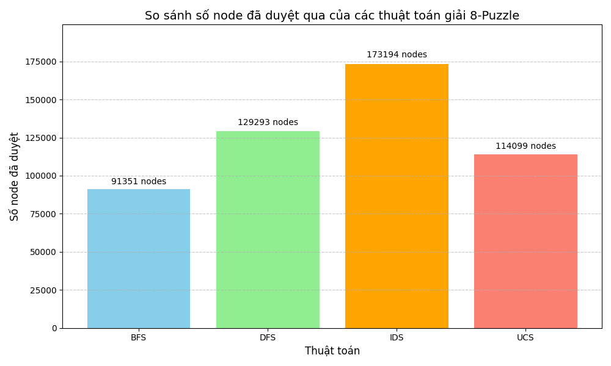
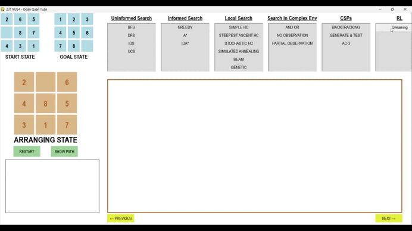

# 🎓 Đồ Án Cá Nhân - Bài toán 8 puzzle
### Họ tên: Đoàn Quân Tuấn
### MSSV: 23110354  
### Môn học: Trí Tuệ Nhân Tạo
### GVHD: Phan Thị Huyền Trang

#### Link github: https://github.com/doanquantuan/DoAnCaNhan_AI.git

## 🎯 1. Mục Tiêu

Bài toán 8-Puzzle là một bài toán cổ điển trong Trí tuệ nhân tạo. Nó gồm một bảng 3x3 với 8 ô được đánh số từ `1 → 8` và 1 ô trống.  
Mỗi bước đi thực hiện bằng cách trượt một ô liền kề vào ô trống.

🎯 **Mục tiêu:**  
Từ một trạng thái ban đầu, di chuyển các ô để đạt đến trạng thái đích đúng thứ tự.  

Trong đồ án này, ta sử dụng các thuật toán tìm kiếm AI để giải bài toán và so sánh hiệu suất giữa các thuật toán dựa trên:
- Độ dài lời giải
- Thời gian thực thi
- Số trạng thái đã duyệt

## 📚 2. Nội Dung

### 2.1. 🔍 Các Thuật Toán Tìm Kiếm Không Có Thông Tin (Uninformed Search)

Uninformed Search là nhóm thuật toán không sử dụng thông tin ước lượng từ trạng thái hiện tại đến đích. Chúng duyệt không gian trạng thái một cách mù quáng và không đảm bảo hiệu quả cao.

#### 🧠 Các thuật toán được áp dụng:
- 🔹 **BFS (Breadth-First Search)**:  
  Mở rộng các node theo tầng → tìm được lời giải ngắn nhất (nếu chi phí bằng nhau).  
- 🔹 **DFS (Depth-First Search)**:  
  Mở rộng theo nhánh sâu nhất trước → tiết kiệm bộ nhớ, nhưng dễ lặp vô hạn, không tối ưu.
- 🔹 **IDS (Iterative Deepening Search)**:  
  Lặp DFS với độ sâu tăng dần → kết hợp ưu điểm của BFS và DFS.
- 🔹 **UCS (Uniform Cost Search)**:  
  Mở rộng node có tổng chi phí nhỏ nhất → tối ưu về chi phí nếu bước đi có trọng số.

#### 🧩 Các thành phần của bài toán tìm kiếm:
- **Không gian trạng thái**: Tất cả các cấu hình có thể của bảng 3x3.
- **Trạng thái đầu**: Cấu hình ban đầu của ô số.
- **Trạng thái đích**: Cấu hình đúng thứ tự mong muốn.
- **Hành động**: Di chuyển ô trống (↑ ↓ ← →).
- **Chi phí**: Tổng chi phí tích lũy để đi từ trạng thái đầu đến trạng thái hiện tại (nếu có trọng số tùy vào bài toán có đặt hay không).
#### 🛠️ Giải pháp chung:
1. Khởi tạo trạng thái ban đầu và đích  
2. Duyệt không gian trạng thái bằng thuật toán đã chọn  
3. Lưu vết trạng thái đã đi qua để tránh vòng lặp  
4. Khi đạt đến trạng thái đích → trả về lời giải

#### ▶️ Video mô phỏng quá trình thuật toán giải bài toán 8-Puzzle

1. BFS

2.DFS

3.IDS

4. UCS

### 📊 So Sánh Hiệu Suất Thuật Toán

1. So sánh thời gian thực hiện thuật toán

2. So sánh số node đã duyệt

3. So sánh số bước lời giải

#### ✅ Một vài nhận xét:
| Thuật toán | Tối ưu | Bộ nhớ | Tốc độ | Nhận xét |
|------------|--------|--------|--------|----------|
| **BFS**    | ✅     | ❌     | ✅     | Tìm ra lời giải ngắn nhất, số node duyệt qua ít nhất và thời gian thực thi ngắn nhất => Hiệu suất tốt nhất |
| **DFS**    | ❌     | ❌     | ❌     | Tìm ra lời giải dài nhất, số node duyệt qua nhiều nhất và thời gian thực thi dài nhất và không tối ưu, không đảm bảo tìm ra lời giải (nếu không kiểm soát độ sâu) => Hiệu suất kém nhất. |
| **IDS**    | ✅     | ❌     | ✅     | Lời giải ngắn (do kết hợp BFS và DFS), tốn thời gian do lặp đi lặp lại nhiều lần các node cùng cấp độ. vẫn chậm trong các trường hợp lời giải sâu. |
| **UCS**    | ✅     | ❌     | ✅     | Lời giải tối ưu dựa trên tổng chi, thời gian tốt hơn IDS và tiết kiệm không gian lưu trữ => Hiệu quả khi các bước có chi phí không đồng đều.|

### 2.2. 🔍 Các Thuật Toán Tìm Kiếm Có Thông Tin (Informed Search)

Informed Search là nhóm thuật toán tìm kiếm sử dụng hàm đánh giá (heuristic function) để ước lượng khoảng cách từ trạng thái hiện tại đến trạng thái đích giúp tối ưu lời giải và giảm thiểu thời gian và số trạng thái phải duyệt.

#### 🧠 Các thuật toán được áp dụng:
- 🔹 **Greedy Best-First Search**:  
  Mở rộng các node gần đích nhất theo heuristi.
- 🔹 **A Star Search**:  
  Mở rộng các node bằng cách xem xét chi phí tích lũy và chi phí ước lượng (heuristic) f(n) = g(n) + h(n).
- 🔹 **IDA Star (Iterative Deepening A Star)**:  
  Tìm kiếm theo chiều sâu (DFS) lặp lại, nhưng với ngưỡng cắt (threshold) f(n) = g(n) + h(n).

#### 🧩 Các thành phần của bài toán tìm kiếm:
- **Không gian trạng thái**: Tất cả các cấu hình có thể của bảng 3x3.
- **Trạng thái đầu**: Cấu hình ban đầu của ô số.
- **Trạng thái đích**: Cấu hình đúng thứ tự mong muốn.
- **Hành động**: Di chuyển ô trống (↑ ↓ ← →).
- **Chi phí**: Tổng chi phí tích lũy để đi từ trạng thái đầu đến trạng thái hiện tại + ước lượng chi phí từ trạng thái điện tại đến đích (f(n) = g(n) + h(n)).
#### 🛠️ Giải pháp chung:
1. Khởi tạo hàng đợi ưu tiên hoặc hàm lặp sâu (tùy thuật toán).
2. Thêm trạng thái ban đầu với chi phí vào danh sách mở rộng.
3. Lặp:
- Lấy trạng thái có chi phí thấp nhất ra.
- Nếu là trạng thái đích → Trả về lời giải.
- Mở rộng trạng thái (theo hành động hợp lệ).
- Tính chi phí cho mỗi trạng thái mới.
- Thêm vào danh sách mở rộng nếu chưa được duyệt hoặc có chi phí tốt hơn.
4. Lặp đến khi tìm được lời giải hoặc không còn trạng thái nào.

#### ▶️ Video mô phỏng quá trình thuật toán giải bài toán 8-Puzzle

1. Greedy Best-First Search

2. A* Search

3. IDA* Search

### 📊 So Sánh Hiệu Suất Thuật Toán

1. So sánh thời gian thực hiện thuật toán

2. So sánh số node đã duyệt

3. So sánh số bước lời giải

4. So sánh chi phí

#### ✅ Một vài nhận xét:
- Greedy Best-First Search: nhanh, thường mở rất ít node vì chỉ đi theo hướng có giá trị hueristic nhỏ nhất, có thể bỏ qua đường đi tốt nhất dẫn đến chất lượng lời giải bị giảm so với A*. Tuy nhiên, nó lại tiết kiệm bộ nhớ hơn A* do không cần phải lưu tổng chi phí tích lũy.
- A* Search: cân bằng giữa tốc độ và tối ưu khi có thể tìm ra lời giải ngắn với tốc độ tương đối, giảm chi phí đường đi khi xem xét giá trị chi phí thực và chi phí ước lượng.
- IDA* Search: tối ưu như A*, tuy nhiên tốn thời gian hơn A* vì phải lặp lại nhiều lần (lặp sâu), mỗi vòng lặp lặp lại phần lớn không gian đã duyệt.

### 2.3. 🔍 Các Thuật Toán Tìm Kiếm Cục Bộ (Local Search)

Local Search là một nhóm các thuật toán tìm kiếm trạng thái mà không cần phải duyệt toàn bộ không gian trạng thái. Thay vào đó, nó chỉ tập trung vào một trạng thái hiện tại và các trạng thái lân cận của nó.

#### 🧠 Các thuật toán được áp dụng:
- 🔹 **Simple Hill Climbing**:  
   Chọn ngay lập tức một trạng thái lân cận tốt hơn, dừng khi không có trạng thái tốt hơn.
- 🔹 **Steepest-Ascent Hill Climbing**:  
   Duyệt qua tất cả các trạng thái lân cận, chọn ra trạng thái tốt nhất trong số đó rồi chuyển đến.
- 🔹 **Stochastic Hill Climbing**:  
   Chọn ngẫu nhiên trong số các trạng thái tốt hơn.
- 🔹 **Simulated Annealing**:  
   Chấp nhận trạng thái tệ hơn để thoát khỏi cực trị địa phương.
- 🔹 **Local Beam Search**:  
   Theo dõi nhiều trạng thái cùng lúc, giữ lại k trạng thái tốt nhất để tiếp tục mở rộng. 
- 🔹 **Genetic Algorithm**:  
   Dựa vào quá trình tiến hóa tự nhiên (chọn lọc, lai ghép, đột biến). Làm việc với quần thể trạng thái.

#### 🧩 Các thành phần của bài toán tìm kiếm:
- **Không gian trạng thái**: Tất cả các cấu hình có thể của bảng 3x3 và chỉ khai thác cục bộ quanh trạng thái hiện tại.
- **Trạng thái đầu**: Cấu hình ban đầu của ô số.
- **Trạng thái đích**: Cấu hình đúng thứ tự mong muốn.
- **Hành động**: Di chuyển ô trống (↑ ↓ ← →).
- **Chi phí**: Chi phí tốt nhất ở trạng thái đang xét.
#### 🛠️ Giải pháp chung:
1. Khởi tạo: Bắt đầu từ một trạng thái ngẫu nhiên hoặc trạng thái ban đầu nào đó.
2. Lặp lại cho đến khi dừng:
- Sinh ra các trạng thái lân cận của trạng thái hiện tại.
- Chọn trạng thái tốt hơn trong các trạng thái lân cận (theo hàm mục tiêu).
- Chuyển đến trạng thái đó nếu nó cải thiện kết quả.
- Nếu không có trạng thái nào tốt hơn, kết thúc (có thể đang ở cực trị địa phương).
3. Trả về trạng thái hiện tại như là lời giải (tốt nhất tìm được).

#### ▶️ Video mô phỏng quá trình thuật toán giải bài toán 8-Puzzle

1. Simple Hill Climbing

2. Steepest-Ascent Hill Climbing

3. Stochastic Hill Climbing

4. Simulated Annealing

5. Loacl Beam Search

6. Genetic Algorithm

#### 📊 So Sánh Hiệu Suất Thuật Toán

1. So sánh thời gian thực thi và giá trị hueristic ở trạng thái cuối cùng

   
2. So sánh số node đã duyệt

3. So sánh số bước thực hiện

#### ✅ Một vài nhận xét:
- Simple Hill Climbing: rất nhanh, đơn giản, tốn ít bộ nhớ, dễ mắc kẹt và không tìm được lối ra trong không gian tìm kiếm phức tạp => Chỉ nên dùng cho bài toán dễ, nhỏ.
- Steepest-Ascent Hill Climbing; mặc dù có những cải tiến từ Simple Hill Climbing những vẫn rất dễ thất bại trong không gian tìm kiếm phức tạp => Chỉ nên dùng cho bài toán dễ, nhỏ.
- Stochastic Hill Climbing: có thể tránh mắc kẹt tại các cực trị cục bộ nhỏ, khám phá đa dạng hơn so với Steepest HC, dễ bỏ lỡ cơ hội cải tiến lớn do việc chọn ngẫu nhiên => Chỉ nên dùng cho bài toán dễ, nhỏ.
- Simulated Annealing: có khả năng thoát khỏi cực trị cục bộ, tuy nhiên thời gian chạy dài và nhạy cảm cảm với các giá trị nhiệt độ và làm nguội => Cần tinh chỉnh các giá trị nhiệt độ đê đảm bảo tìm được trạng thái tốt nhất.
- Loacl Beam Search: giảm nguy cơ mắc kẹt ở cực trị cục bộ, khám phá song song nhiều hướng, giá trị k càng lớn càng tốn thời gian và tài nguyên => Cần lựa chọn giá trị k hợp lí.
- Genetic Algorithm: tìm lời giải đa dạng, có thể tránh kẹt tốt, cần nhiều thế hệ (tốc độ chậm), không đảm bảo tối ưu, phụ thuộc thiết kế: chọn lọc, đột biến, hàm đánh giá.

### 2.4. 🔍 Các Thuật Toán Tìm Kiếm Trong Môi Trường Phức Tạp (Searching In Complex Environments)

Searching In Complex Environments là tìm kiếm trong các môi trường bất định và không chính xác. Các môi trường này có thể có các yếu tố như có cấu trúc tìm kiếm phức tạp với các hành động cho kết quả không chắc chắn, không thể biết chính xác trạng thái hiện tại hay chỉ quan sát được được một phần thông tin.

#### 🧠 Các thuật toán được áp dụng:
- 🔹 **And Or Search**:
   Áp dụng trong môi trường không xác định, một hành động có thể dẫn đến nhiều kết quả khác nhau.
- 🔹 **Searching With No Observation**:  
   Môi trường hoàn toàn không thể quan sát được trạng thái hiện tại sau mỗi hành động.
- 🔹 **Searching For Partially Observation**:  
   Tác nhân có thể quan sát một phần trạng thái hiện tại thông qua cảm biến (sensor).
  
#### 🧩 Các thành phần của bài toán tìm kiếm:
-	Không gian trạng thái: tất cả các trạng thái có thể có trong môi trường.
-	Hành động: tất cả hành động mà agent có thể thực hiện (lên, xuống, trái, phải).
-	Trạng thái đầu: là 1 trạng thái đơn lẻ (nếu quan sát được) hoặc 1 tập các trạng thái niềm tin (nếu không thể quan sát hoặc quan sát không đầy đủ).
-	Mục tiêu: Trạng thái mà agent muốn đạt tới.
-	Chi phí: Chi phí giữa các hành động.
#### 🛠️ Giải pháp chung:
1. Xác định không gian trạng thái: Có thể là trạng thái thật, hoặc tập hợp các trạng thái niềm tin (belief states) nếu không thể quan sát hoàn toàn.
2. Xây dựng mô hình hành động: Mỗi hành động có thể đưa đến nhiều kết quả khác nhau (không chắc chắn).
3. Dự đoán và mô phỏng kết quả hành động: Dự đoán trạng thái mới sau hành động (với xác suất hoặc theo cây kế hoạch AND-OR).
4. Lập kế hoạch hành động thích ứng: Tạo cây hành động mà tác nhân có thể chọn nhánh khác nếu điều kiện thay đổi.
5. Cập nhật belief state liên tục: Sau mỗi bước, cập nhật lại trạng thái.
6. Ra quyết định dựa trên thông tin hiện có: Chọn hành động tối ưu dựa trên khả năng thành công.

#### ▶️ Video mô phỏng quá trình thuật toán giải bài toán 8-Puzzle

1. And Or Search

3. Searching With No Observation

5. Searching For Partially Observation

### 📊 So Sánh Hiệu Suất Thuật Toán

1. So sánh thời gian thực hiện thuật toán

2. So sánh số node đã duyệt

3. So sánh số bước lời giải

#### ✅ Một vài nhận xét:
-	And Or Search: Hiệu suất kém do phải xử lý cây kế hoạch có nhánh AND (số lượng node tăng nhanh nếu có nhiều hành động), đệ quy quá sâu không tìm được lời giải, gây lỗi => Hiệu suất rất thấp
-	Searching With No Observation: belief state rất lớn, nếu chọn ra các trạng thái niềm tin quá khác nhau dẫn đến thời gian tìm kiếm rất lâu hoặc không tìm ra kế hoạch => hiệu suất thấp.
-	Searching For Partially Observation: nếu loại trừ trạng thái không phù hợp giúp thu hẹp không gian niềm tin, hiệu suất phụ thuộc vào thông tin quan sát được ít hay nhiều => Hiệu suất trung bình.

### 2.5. Các thuật toán thỏa mãn ràng buộc (Constraint Satisfaction Problem - CSP)

CSP là một bài toán trong trí tuệ nhân tạo mà lời giải là một tập giá trị gán cho các biến sao cho thỏa mãn toàn bộ ràng buộc (constraints) đã cho trước.

#### 🧠 Các thuật toán được áp dụng:
- 🔹 **Generate And Test**:
   Liệt kê tất cả các khả năng có thể, sau đó kiểm tra xem khả năng nào thoả mãn tất cả các ràng buộc.
- 🔹 **Backtracking**:  
   Duyệt từng biến, thử từng giá trị trong miền, lùi lại (backtrack) nếu không thoả mãn ràng buộc.
- 🔹 **AC-3**:  
   Lan truyền ràng buộc (Constraint Propagation). Nó loại bỏ các giá trị không hợp lệ khỏi miền giá trị của biến trước khi bắt đầu tìm kiếm.

#### 🧩 Các thành phần của bài toán tìm kiếm:
- Biến: Mỗi ô là 1 biến (8 biến và 1 ô trống).
- Miền giá trị: {1, 2,…, 8}
- Ràng buộc: Các ô có giá trị khác nhau không trùng lặp và theo thứ tự tăng dần từ trên xuống, từ trái qua phải.
#### 🛠️ Giải pháp chung: 
Gán giá trị cho tất cả các biến đảm bảo thỏa mãn ràng buộc.

#### ▶️ Video mô phỏng quá trình thuật toán giải bài toán 8-Puzzle

1. Generate And Test

3. Backtracking
   

5. AC - 3

### 📊 So Sánh Hiệu Suất Thuật Toán

1. So sánh thời gian thực hiện thuật toán

2. So sánh số bước lời giải

#### ✅ Một vài nhận xét:
+ Generate and Test: hiệu suất ban đầu rất kém do có không gian trạng thái có rất nhiều trạng thái để sinh và kiểm tra. Sau khi kết hợp với kĩ thuật Degree Heuristic (Ưu tiên biến liên quan nhiều ràng buộc), giúp tăng xác suất gặp lời giải sớm hơn => hiệu suất trung bình
+ Backtracking: kiểm tra ràng buộc tại thời điểm gán, loại bỏ các nhánh sai sớm => hiệu suất trung bình tốt
+ AC-3 (+Backtracking): Lọc domain trước khi giải, giảm đáng kể số trường hợp cần xét, kết hợp với backtracking quay lui nếu phát hiện sai => hiệu suất tốt.

### 2.5. Học tăng cường (Reinforcement Learning)
Reinforcement Learning (RL) hay Học tăng cường là một nhánh của Machine Learning, trong đó một tác nhân học cách ra quyết định tối ưu thông qua việc tương tác với môi trường, nhận phần thưởng hoặc hình phạt cho từng hành động.

#### 🧠 Thuật toán được áp dụng: Q - Learning
#### 🧩 Các thành phần:
- Tác nhân
- Môi trường
- Trạng thái
- Hành động
- Thưởng, phạt
- Chiến lược chọn hành động
- Hàm đánh giá
- Bảng Q
### 🛠️ Giải pháp:
1. Khởi tạo một bảng Q và điền các giá trị ban đầu vào đó.
2. Bắt đầu một episode.
3. Tác nhân thực hiện hành động.
4. Xác định phần thưởng nhận được.
5. Chuyển sang trạng thái mới.
6. Q-value mới được tính cho trạng thái mới.
7. Episode kết thúc do lỗi hoặc thắng hoặc hết thời gian.
8. Môi trường được thiết lập lại.
9. Lặp lại các bước 2-8 cho số episode mong muốn.

Trong đó:
- Q(s, a): Giá trị Q của hành động a trong trạng thái s, đại diện cho giá trị kỳ vọng của hành động đó.
- t: Thời điểm (lần cập nhật)
- α: Hệ số học (learning rate), 0 < 𝛼 ≤ 1. Điều chỉnh mức độ ta tin vào giá trị mới so với cũ.
- TD_t(s, a): Sai số dự đoán theo phương pháp Temporal Difference tại thời điểm t.

- R(s, a): Phần thưởng trực tiếp khi thực hiện hành động a tại trạng thái s.
- γ: Hệ số chiết khấu (discount factor), 0 ≤ 𝛾 ≤ 1, cho biết mức độ ưu tiên phần thưởng tương lai.
- P(s, a, s'): Xác suất chuyển từ trạng thái s sang trạng thái s' khi thực hiện hành động a.
- max Q(s', a'): Giá trị Q lớn nhất có thể đạt được tại trạng thái tiếp theo s', nếu chọn hành động tối ưu a'.

🔁 Tóm tắt quá trình cập nhật Q-table:
- Bắt đầu từ trạng thái s và thực hiện hành động a.
- Nhận phần thưởng R(s, a) và xác định xác suất chuyển sang các trạng thái tiếp theo s'.
- Tính sai số TD (temporal difference).
- Cập nhật Q(s, a) theo sai số này.

#### ▶️ Video mô phỏng quá trình thuật toán giải bài toán 8-Puzzle

Q - learning

#### ✅ Một vài nhận xét:
- Chiến lược khám phá ảnh hưởng trực tiếp đến hiệu suất thời gian học và độ chính xác của chính sách cuối cùng, ε nhỏ thì dễ mắc kẹt, ε lớn thì học chậm do quá nhiều hành động.
- Tốn bộ nhớ, tốc độ cập nhật chậm. 

## 📝 3. Kết Luận

### Các kết quả đạt được:
- Áp dụng thành công 6 nhóm thuật toán vào bài toán 8 puzzle.
- Hiểu được ưu điểm, nhược điểm và khả năng ứng dụng hiệu quả của từng thuật toán AI trong việc giải quyết các bài toán tìm kiếm trạng thái.
- Qua quá trình thực nghiệm và đánh giá hiệu suất, ta có một số kết luận về các nhóm thuật toán như sau: Uninformed Search đảm bảo tìm được nhưng hiệu suất thấp hơn rất nhiều khi số bước tăng cao; Informed Search đảm bảo tìm được lời giải với đường đi ngắn hơn và tốt hơn; Local Search tối ưu hóa và không cần giải chính xác tuyệt đối tuy nhiên dễ mắc kẹt khi không gian tìm kiếm quá phức tạp; Searching In Complex Environments có không gian trạng thái lớn, có thể không biết rõ trạng thái, chi phí hành động, hoặc xác suất chuyển trạng thái; CSP giải quyết các bài toán phức tạp bằng cách biểu diễn các biến và ràng buộc một cách rõ ràng; Reinforcement Learning cải thiện chính sách hành động để tối ưu hóa phần thưởng lâu dài, tuy nhiên quá trình học thường đòi hỏi nhiều tài nguyên tính toán và thời gian do phải thử nghiệm và sai sót liên tục.

### Định hướng phát triển
- Nâng cấp giao diện trực quan giúp người dùng tương tác và hiểu quá trình giải bài toán.
- Mở rộng bài toán sang các phiên bản phức tạp hơn như 15-puzzle hoặc các bài toán sắp xếp tương tự để phát triển các phương pháp giải tổng quát, hiệu quả cho không gian trạng thái lớn hơn.
- Nghiên cứu các kỹ thuật tối ưu hóa và song song hóa nhằm tăng tốc quá trình giải quyết, từ đó có thể ứng dụng trong các hệ thống thời gian thực hoặc các bài toán phức tạp liên quan.

### Tài liệu tham khảo:
- Russell, S. J., & Norvig, P. (2016). Artificial Intelligence: A Modern Approach (3rd ed.). Pearson
- Pearl, J. (1984). Heuristics: Intelligent Search Strategies for Computer Problem Solving. Addison-Wesley.
- Sutton, R. S., & Barto, A. G. (2018). Reinforcement Learning: An Introduction (2nd ed.). MIT Press.
- GeeksforGeeks. (n.d.). Q-learning in Python. GeeksforGeeks. Truy cập ngày 18/5/2025 từ https://www.geeksforgeeks.org/q-learning-in-python/

> 📁 *Đồ án này được thực hiện phục vụ môn học Trí tuệ nhân tạo. Mọi đóng góp hoặc phản hồi xin gửi qua GitHub.*

