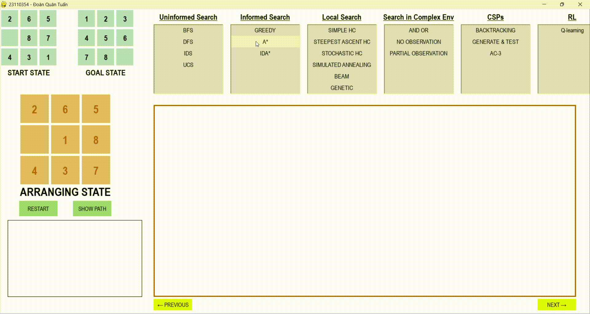

# 🎓 Đồ Án Cá Nhân - Bài toán 8 puzzle
### Họ tên: Đoàn Quân Tuấn
### MSSV: 23110354  
### Môn học: Trí Tuệ Nhân Tạo
### GVHD: Phan Thị Huyền Trang

---

## 🎯 1. Mục Tiêu

Bài toán **8-Puzzle** là một bài toán cổ điển trong Trí tuệ nhân tạo. Nó gồm một bảng 3x3 với 8 ô được đánh số từ `1 → 8` và **1 ô trống**.  
Mỗi bước đi thực hiện bằng cách **trượt một ô liền kề vào ô trống**.

🎯 **Mục tiêu:**  
Từ một **trạng thái ban đầu**, di chuyển các ô để đạt đến **trạng thái đích** đúng thứ tự.  

Trong đồ án này, ta sử dụng các **thuật toán tìm kiếm AI** để giải bài toán và so sánh hiệu suất giữa các thuật toán dựa trên:
- Độ dài lời giải
- Thời gian thực thi
- Số trạng thái đã duyệt

---

## 📚 2. Nội Dung

### 2.1. 🔍 Các Thuật Toán Tìm Kiếm Không Có Thông Tin (Uninformed Search)

Uninformed Search là nhóm thuật toán **không sử dụng thông tin ước lượng** từ trạng thái hiện tại đến đích. Chúng **duyệt không gian trạng thái một cách mù quáng** và không đảm bảo hiệu quả cao.

#### 🧠 Các thuật toán được áp dụng:
- 🔹 **BFS (Breadth-First Search)**:  
  Mở rộng các node theo tầng → tìm được lời giải ngắn nhất (nếu chi phí bằng nhau).  
- 🔹 **DFS (Depth-First Search)**:  
  Mở rộng theo nhánh sâu nhất trước → tiết kiệm bộ nhớ, nhưng dễ lặp vô hạn, không tối ưu.
- 🔹 **IDS (Iterative Deepening Search)**:  
  Lặp DFS với độ sâu tăng dần → kết hợp ưu điểm của BFS và DFS.
- 🔹 **UCS (Uniform Cost Search)**:  
  Mở rộng node có tổng chi phí nhỏ nhất → tối ưu về chi phí nếu bước đi có trọng số.

#### 🧩 Các thành phần của bài toán tìm kiếm:
- **Không gian trạng thái**: Tất cả các cấu hình có thể của bảng 3x3.
- **Trạng thái đầu**: Cấu hình ban đầu của ô số.
- **Trạng thái đích**: Cấu hình đúng thứ tự mong muốn.
- **Hành động**: Di chuyển ô trống (↑ ↓ ← →).
- **Chi phí**: Tổng chi phí tích lũy để đi từ trạng thái đầu đến trạng thái hiện tại (nếu có trọng số tùy vào bài toán có đặt hay không).
#### 🛠️ Giải pháp chung:
1. Khởi tạo trạng thái ban đầu và đích  
2. Duyệt không gian trạng thái bằng thuật toán đã chọn  
3. Lưu vết trạng thái đã đi qua để tránh vòng lặp  
4. Khi đạt đến trạng thái đích → trả về lời giải

#### ▶️ Video mô phỏng quá trình thuật toán giải bài toán 8-Puzzle

1. BFS

2.DFS

3.IDS

4. UCS

### 📊 So Sánh Hiệu Suất Thuật Toán

1. So sánh thời gian thực hiện thuật toán

2. So sánh số node đã duyệt

3. So sánh số bước lời giải

#### ✅ Một vài nhận xét:
| Thuật toán | Tối ưu | Bộ nhớ | Tốc độ | Nhận xét |
|------------|--------|--------|--------|----------|
| **BFS**    | ✅     | ❌     | ✅     | Tìm ra lời giải ngắn nhất, số node duyệt qua ít nhất và thời gian thực thi ngắn nhất => Hiệu suất tốt nhất |
| **DFS**    | ❌     | ❌     | ❌     | Tìm ra lời giải dài nhất, số node duyệt qua nhiều nhất và thời gian thực thi dài nhất và không tối ưu, không đảm bảo tìm ra lời giải (nếu không kiểm soát độ sâu) => Hiệu suất kém nhất. |
| **IDS**    | ✅     | ❌     | ✅     | Lời giải ngắn (do kết hợp BFS và DFS), tốn thời gian do lặp đi lặp lại nhiều lần các node cùng cấp độ. vẫn chậm trong các trường hợp lời giải sâu. |
| **UCS**    | ✅     | ❌     | ✅     | Lời giải tối ưu dựa trên tổng chi, thời gian tốt hơn IDS và tiết kiệm không gian lưu trữ => Hiệu quả khi các bước có chi phí không đồng đều.|

---
### 2.2. 🔍 Các Thuật Toán Tìm Kiếm Có Thông Tin (Informed Search)

Informed Search là nhóm thuật toán tìm kiếm sử dụng **hàm đánh giá (heuristic function)** để ước lượng khoảng cách từ trạng thái hiện tại đến trạng thái đích giúp tối ưu lời giải và giảm thiểu thời gian và số trạng thái phải duyệt.

#### 🧠 Các thuật toán được áp dụng:
- 🔹 **Greedy Best-First Search**:  
  Mở rộng các node gần đích nhất theo heuristi.
- 🔹 **A Star Search**:  
  Mở rộng các node bằng cách xem xét chi phí tích lũy và chi phí ước lượng (heuristic) f(n) = g(n) + h(n).
- 🔹 **IDA Star (Iterative Deepening A Star)**:  
  Tìm kiếm theo chiều sâu (DFS) lặp lại, nhưng với ngưỡng cắt (threshold) f(n) = g(n) + h(n).

#### 🧩 Các thành phần của bài toán tìm kiếm:
- **Không gian trạng thái**: Tất cả các cấu hình có thể của bảng 3x3.
- **Trạng thái đầu**: Cấu hình ban đầu của ô số.
- **Trạng thái đích**: Cấu hình đúng thứ tự mong muốn.
- **Hành động**: Di chuyển ô trống (↑ ↓ ← →).
- **Chi phí**: Tổng chi phí tích lũy để đi từ trạng thái đầu đến trạng thái hiện tại + ước lượng chi phí từ trạng thái điện tại đến đích (f(n) = g(n) + h(n)).
#### 🛠️ Giải pháp chung:
1. Khởi tạo hàng đợi ưu tiên hoặc hàm lặp sâu (tùy thuật toán).
2. Thêm trạng thái ban đầu với chi phí vào danh sách mở rộng.
3. Lặp:
- Lấy trạng thái có chi phí thấp nhất ra.
- Nếu là trạng thái đích → Trả về lời giải.
- Mở rộng trạng thái (theo hành động hợp lệ).
- Tính chi phí cho mỗi trạng thái mới.
- Thêm vào danh sách mở rộng nếu chưa được duyệt hoặc có chi phí tốt hơn.
4. Lặp đến khi tìm được lời giải hoặc không còn trạng thái nào.

#### ▶️ Video mô phỏng quá trình thuật toán giải bài toán 8-Puzzle

1. Greedy Best-First Search

2. A* Search

3. IDA* Search

### 📊 So Sánh Hiệu Suất Thuật Toán

1. So sánh thời gian thực hiện thuật toán

2. So sánh số node đã duyệt

3. So sánh số bước lời giải

4. So sánh chi phí

---
### 2.3. 🔍 Các Thuật Toán Tìm Kiếm Cục Bộ (Local Search)

Local Search là một nhóm các thuật toán tìm kiếm trạng thái mà không cần phải duyệt toàn bộ không gian trạng thái. Thay vào đó, nó chỉ tập trung vào một **trạng thái hiện tại** và các **trạng thái lân cận** của nó.

#### 🧠 Các thuật toán được áp dụng:
- 🔹 **Simple Hill Climbing**:  
   Chọn ngay lập tức một trạng thái lân cận tốt hơn, dừng khi không có trạng thái tốt hơn.
- 🔹 **Steepest-Ascent Hill Climbing**:  
   Duyệt qua tất cả các trạng thái lân cận, chọn ra trạng thái tốt nhất trong số đó rồi chuyển đến.
- 🔹 **Stochastic Hill Climbing**:  
   Chọn ngẫu nhiên trong số các trạng thái tốt hơn.
- 🔹 **Simulated Annealing**:  
   Chấp nhận trạng thái tệ hơn để thoát khỏi cực trị địa phương.
- 🔹 **Local Beam Search**:  
   Theo dõi nhiều trạng thái cùng lúc, giữ lại k trạng thái tốt nhất để tiếp tục mở rộng. 
- 🔹 **Genetic Algorithm**:  
   Dựa vào quá trình tiến hóa tự nhiên (chọn lọc, lai ghép, đột biến). Làm việc với quần thể trạng thái.

#### 🧩 Các thành phần của bài toán tìm kiếm:
- **Không gian trạng thái**: Tất cả các cấu hình có thể của bảng 3x3 và chỉ khai thác cục bộ quanh trạng thái hiện tại.
- **Trạng thái đầu**: Cấu hình ban đầu của ô số.
- **Trạng thái đích**: Cấu hình đúng thứ tự mong muốn.
- **Hành động**: Di chuyển ô trống (↑ ↓ ← →).
- **Chi phí**: Chi phí tốt nhất ở trạng thái đang xét.
#### 🛠️ Giải pháp chung:
1. Khởi tạo: Bắt đầu từ một trạng thái ngẫu nhiên hoặc trạng thái ban đầu nào đó.
2. Lặp lại cho đến khi dừng:
- Sinh ra các trạng thái lân cận của trạng thái hiện tại.
- Chọn trạng thái tốt hơn trong các trạng thái lân cận (theo hàm mục tiêu).
- Chuyển đến trạng thái đó nếu nó cải thiện kết quả.
- Nếu không có trạng thái nào tốt hơn, kết thúc (có thể đang ở cực trị địa phương).
3. Trả về trạng thái hiện tại như là lời giải (tốt nhất tìm được).

#### ▶️ Video mô phỏng quá trình thuật toán giải bài toán 8-Puzzle

1. Simple Hill Climbing

2. Steepest-Ascent Hill Climbing

3. Stochastic Hill Climbing

4. Simulated Annealing

5. Loacl Beam Search

6. Genetic Algorithm

#### 📊 So Sánh Hiệu Suất Thuật Toán

#### ✅ Một vài nhận xét:

---
### 🔍 Các Thuật Toán Tìm Kiếm Trong Môi Trường Phức Tạp (Searching In Complex Environments)

Searching In Complex Environments là tìm kiếm trong các môi trường bất định và không chính xác. Các môi trường này có thể có các yếu tố như có cấu trúc tìm kiếm phức tạp với các hành động cho kết quả **không chắc chắn**, **không thể biết chính xác trạng thái hiện tại** hay **chỉ quan sát được được một phần thông tin**.

#### 🧠 Các thuật toán được áp dụng:
- 🔹 **And Or Search**:
   Áp dụng trong môi trường không xác định, một hành động có thể dẫn đến nhiều kết quả khác nhau.
- 🔹 **Searching With No Observation**:  
   Môi trường hoàn toàn không thể quan sát được trạng thái hiện tại sau mỗi hành động.
- 🔹 **Searching For Partially Observation**:  
   Tác nhân có thể quan sát một phần trạng thái hiện tại thông qua cảm biến (sensor).
  
#### 🧩 Các thành phần của bài toán tìm kiếm:
-	Không gian trạng thái: tất cả các trạng thái có thể có trong môi trường.
-	Hành động: tất cả hành động mà agent có thể thực hiện (lên, xuống, trái, phải).
-	Trạng thái đầu: là 1 trạng thái đơn lẻ (nếu quan sát được) hoặc 1 tập các trạng thái niềm tin (nếu không thể quan sát hoặc quan sát không đầy đủ).
-	Mục tiêu: Trạng thái mà agent muốn đạt tới.
-	Chi phí: Chi phí giữa các hành động.
#### 🛠️ Giải pháp chung:
1. Xác định không gian trạng thái: Có thể là trạng thái thật, hoặc tập hợp các trạng thái niềm tin (belief states) nếu không thể quan sát hoàn toàn.
2. Xây dựng mô hình hành động: Mỗi hành động có thể đưa đến nhiều kết quả khác nhau (không chắc chắn).
3. Dự đoán và mô phỏng kết quả hành động: Dự đoán trạng thái mới sau hành động (với xác suất hoặc theo cây kế hoạch AND-OR).
4. Lập kế hoạch hành động thích ứng: Tạo cây hành động mà tác nhân có thể chọn nhánh khác nếu điều kiện thay đổi.
5. Cập nhật belief state liên tục: Sau mỗi bước, cập nhật lại trạng thái.
6. Ra quyết định dựa trên thông tin hiện có: Chọn hành động tối ưu dựa trên khả năng thành công.

## 📝 3. Kết Luận

---

> 📁 *Đồ án này được thực hiện phục vụ môn học Trí tuệ nhân tạo. Mọi đóng góp hoặc phản hồi xin gửi qua GitHub.*

